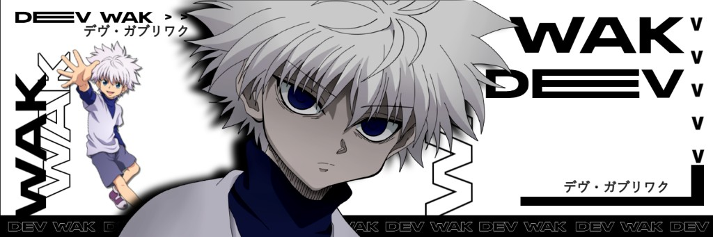
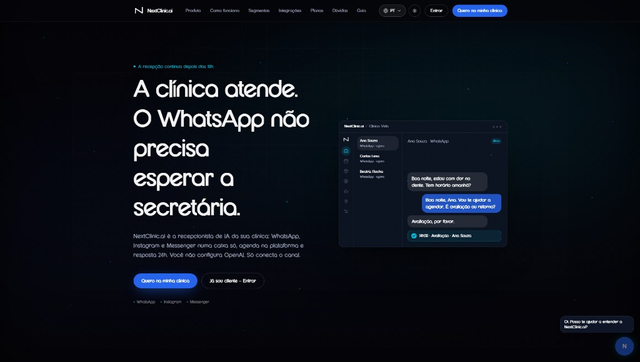
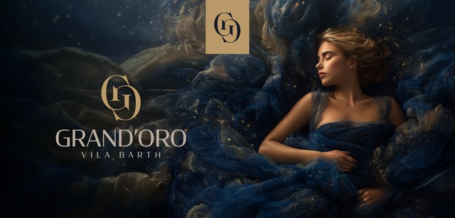
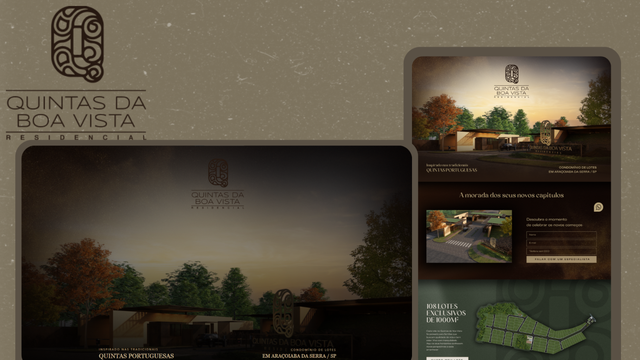
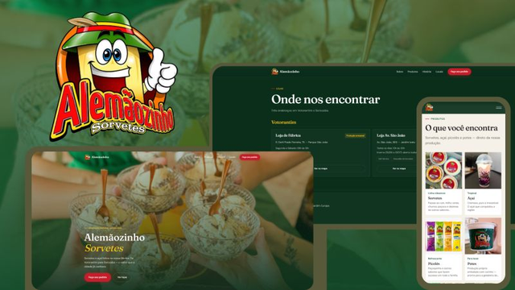
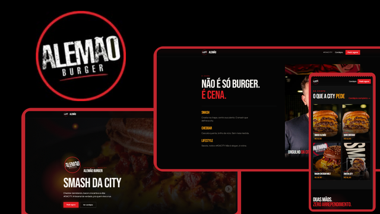

  

<h2 align="center"> Conectar</h2>

---

<h2 align="center"> Sobre mim</h2>

<table>
<tr>
<td width="38%" align="center" valign="top">
  
</td>
<td width="62%" valign="top">

**E aí! Eu sou o Gabriel**

Full-Stack Developer · Sorocaba, SP · Designer Web

Eu projeto, codifico e coloco no ar produtos digitais completos da primeira tela até o domínio publicado. Criei a NextClinic.ai, atendente virtual 24h para clínicas, e também entrego sites e sistemas para negócios reais.

No dia a dia, trabalho com React, TypeScript, Node.js, PostgreSQL e Supabase. Código limpo, performance e entrega no prazo.

</td>
</tr>
</table>

---

<h2 align="center"> Top Projects</h2>

Produtos e sites que eu fiz e coloquei no ar.

 

<table width="100%">
<tr>
<td width="40%" valign="top">
  
</td>
<td width="60%" valign="middle">

**01 · [NEXTCLINIC.AI](https://nextclinicai.com.br/)**

  

Atendente virtual 24h para clínicas. WhatsApp, Instagram e Messenger numa caixa só. Eu fiz e sou o dono.

  

</td>
</tr>
<tr><td colspan="2"> </td></tr>
<tr>
<td width="40%" valign="top">
  
</td>
<td width="60%" valign="middle">

**02 · [GRAND'ORO](https://grandoro-alpha.vercel.app/)**

  

Landing page imobiliária com apresentação visual forte, captação de leads e experiência premium.

  

</td>
</tr>
<tr><td colspan="2"> </td></tr>
<tr>
<td width="40%" valign="top">
  
</td>
<td width="60%" valign="middle">

**03 · [QUINTAS DA BOA VISTA](https://quintasboavista.vercel.app/)**

  

Página de conversão para residencial, com comunicação clara, estética premium e navegação fluida.

  

</td>
</tr>
<tr><td colspan="2"> </td></tr>
<tr>
<td width="40%" valign="top">
  
</td>
<td width="60%" valign="middle">

**04 · [ALEMÃOZINHO SORVETES](https://alemaozinho.vercel.app/)**

  

Presença digital com a mesma confiança que a marca passa no balcão, na embalagem e no dia a dia com o cliente.

  

</td>
</tr>
<tr><td colspan="2"> </td></tr>
<tr>
<td width="40%" valign="top">
  
</td>
<td width="60%" valign="middle">

**05 · [ALEMÃO BURGERS](https://alemaoburgeur.vercel.app/)**

  

Site para hamburgueria com identidade forte, cardápio claro e experiência pensada para converter pedidos.

  

</td>
</tr>
</table>

---

<h2 align="center"> Stack</h2>

---

デヴ・ガブリワク · DEV WAK
